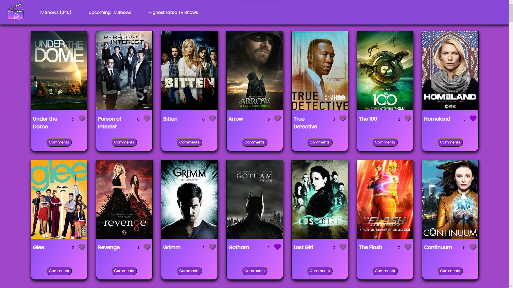

# JS Capstone Project

>  In this project we made a Tv shows webpage where you can like or comment the differents shows.

## Built With

- HTML
- CSS
- JavaScript
- Linters
- API

## Live Demo

[Live Demo Link](https://ryxtor.github.io/JS-group-capstone-project-Lucas-Omar/dist)

## Authors

👤 **Lucas Bonnefon**

- GitHub: [@ryxtor](https://github.com/ryxtor)
- Twitter: [@ryxtor](https://twitter.com/ryxtor)
- LinkedIn: [Lucas Bonnefon](https://www.linkedin.com/in/lucas-bonnefon-074a01134/)

👤 **Omar Ragheb**

- GitHub: [@Omar Ragheb](https://github.com/omar25ahmed)
- Twitter: [@Omar Ragheb](https://twitter.com/omar25ahmed)
- LinkedIn: [Omar Ragheb](https://www.linkedin.com/in/omar-ragheb-65434a202/
)

## 🤝 Contributing

Contributions, issues, and feature requests are welcome!

Feel free to check the [issues page](https://github.com/ryxtor/JS-group-capstone-project-Lucas-Omar/issues).

## Show your support

Give a ⭐️ if you like this project!

## 📝 License

This project is [MIT](./MIT.md)licensed.